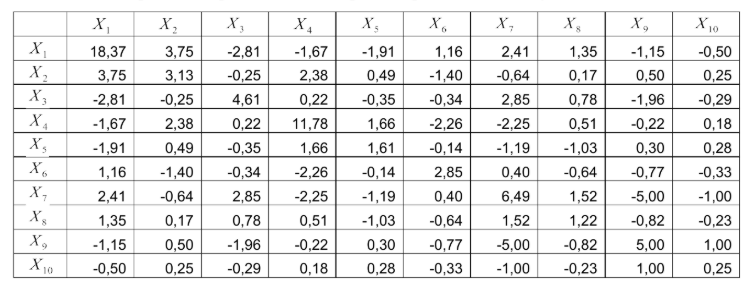
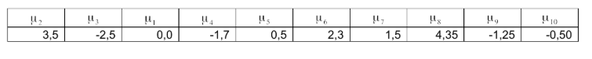
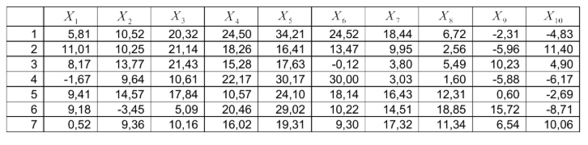
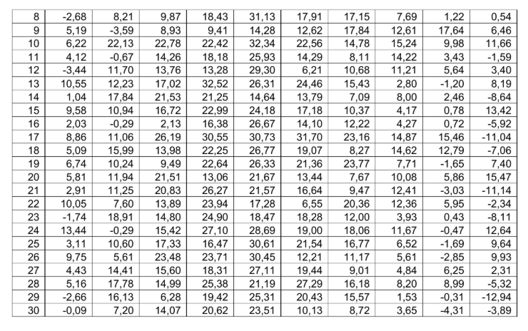
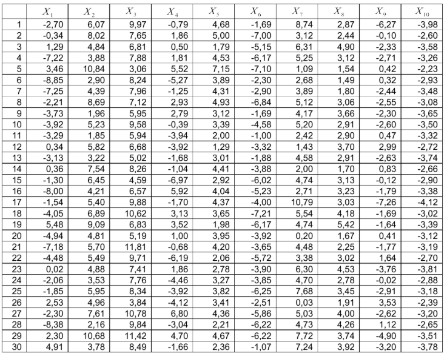

## Теоретические материалы

Подробные выводы критериев проверки гипотез для многомерного нормального распределения приведены в приложенном документе:

📄 [Критерии проверки гипотез (PDF)](lb1\criterion.pdf)

## Лабораторная работа №1
### **Проверка гипотез для параметров нормальной генеральной совокупности**

1. Используя генератор случайных чисел, получить выборку из n=100 значений многомерной нормальной случайной величины {X₅, X₆, X₈} с матрицей ковариаций A (таблица 1) и вектором средних μ (таблица 2). Используя полученную выборку, на уровне значимости 0,06, проверить гипотезу (в предположении, что данные распределены нормально) о равенстве вектора средних и матрицы ковариаций генеральной совокупности вектору μ и матрице A соответственно.

2. По двум независимым выборкам объемов n₁=30 и n₂=30 из многомерных нормальных совокупностей {X₁, X₂, X₃} и {X₆, X₇, X₈} (таблица 3), на уровне значимости 0,1 проверить гипотезу H₀ о равенстве матриц ковариаций A(X₁, X₂, X₃) = A(X₆, X₇, X₈).

3. По выборке объема n=30 из многомерной нормальной совокупности {X₁, X₂, X₁₀} (таблица 4) проверить гипотезу о независимости компонент данной совокупности (указать достигнутый уровень значимости).  

***Таблица 1***. Матрица ковариаций многомерной нормальной совокупности X₁, X₂,...,X₁₀ 

***Таблица 2***. Вектор средних многомерной нормальной совокупности X₁, X₂,...,X₁₀

***Таблица 3.*** Выборка из многомерной нормальной совокупности величин X₁, X₂,...,X₁₀

***Таблица 4.*** Выборка из многомерной нормальной совокупности величин X₁, X₂,...,X₁₀
