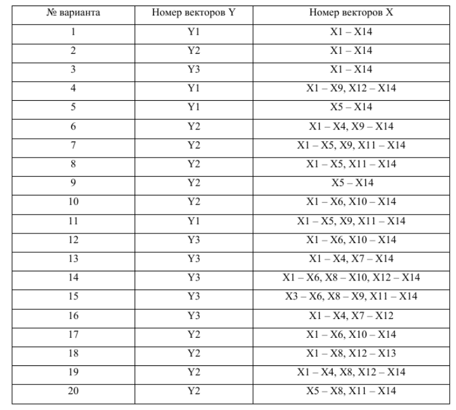

## Теоретические материалы

Подробные выводы критериев проверки гипотез для многомерного нормального распределения приведены в приложенном документе:

📄 [Метод главных компонент PCA](MGK.pdf)

## Лабораторная работа №2
### **Метод главных компонент. Использование МГК для устранения мультиколлинеарности**

**Задание**
В таблице [файл “Данные”, лист “Показатели”](LAB_DATA_MSM.xlsx) приведены значения показателей
производственной деятельности для 53 предприятий машиностроения. Использовались
следующие показатели: 
* Y1 – производительность труда; 
* Y2 – индекс снижения себестоимости продукции; 
* Y3 – рентабельность; 
+ X1 – трудоемкость единицы продукции;
+ X2 – удельный вес рабочих в составе ППП;
+ X3 – удельный вес покупных изделий; 
+ X4 – коэффициент сменности оборудования;
+ X5 – премии и вознаграждения на одного
работника;
+ X6 – удельный вес потерь от брака;
+ X7 – фондоотдача;
+ X8 – среднегодовая
численность ППП;
+ X9 – среднегодовая стоимость ОПФ;
+ X10 – среднегодовой фонд
заработной платы ППП;
+ X11 – фондовооруженность труда;
+ X12 – оборачиваемость
нормируемых оборотных средств;
+ X13 - оборачиваемость ненормируемых оборотных
средств;
+ X14 – непроизводственные расходы.
*Показатели X1 – X14 относятся к определяющим показателям, а Y1 – Y3 к результирующим факторам.*

Требуется:  
1. Для выбранных в соответствии с вариантом задания определяющих показателей (смотри таблицу 1) перейти от пространства исходных факторов к пространству главных компонент:  
    a)Найти собственные значения и собственные векторы выборочной матрицы
    ковариаций, упорядоченные по убыванию собственных значений. Оценить долю
    общей дисперсии объясняемой каждой главной компонентой и совокупностью  
    главных компонент (двух, трех и т.д.).  

    b)Определить количество значимых главных компонент, ориентируясь на: долю
    выделенной дисперсии, критерий Кайзера, правило сломанной трости, критерий
    Кэттелла (каменистой осыпи).  

    c)Записать выражения для значимых главных компонент через исходные признаки
    (выписать в явном виде линейные комбинации, определяющие компоненты), а также получить оценки векторов значений значимых главных компонент по всем
    наблюдениям.  

    d)Определить какие признаки вносят наибольший вклад в каждую значимую главную
    компоненту и, соответственно, долю этого вклада в компоненту.
2. Построить и сравнить модели множественной линейной регрессии:  
    a)связывающую результирующий показатель (указанный в варианте задания) и все
    главные компоненты, статистически значимо влияющие на результирующий
    показатель;  

    b)связывающую результирующий показатель (указанный в варианте задания) и все
    значимые главные компоненты (определенные в пункте 1b), статистически значимо
    влияющие на результирующий показатель.

*Таблица 1.* Варианты для расчета
