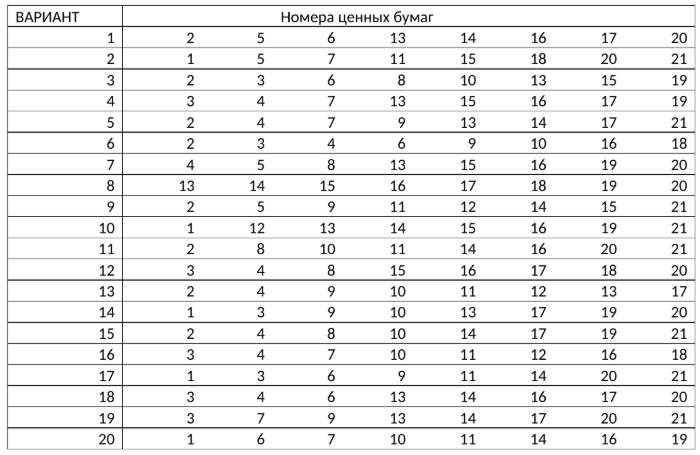

## Теоретические материалы

Подробные о факторном анализе методом главных компонент:

📄 [Факторный анализ. Метод главных компонент PCA](FA_MGK.pdf)

## Лабораторная работа №3
### **Метод главных компонент. Использование МГК для устранения мультиколлинеарности**

**Задание**
В таблице [файл “Данные”, лист “Котировки”](LAB_DATA_MSM.xlsx) приведены цены закрытия акций на ММВБ за
период с 01.01.2015 по 01.09.2015 с периодичностью 1 день.  
*Требуется:*
1. Для относительных приращений, приведенных в варианте задания ценных бумаг (таблица 1), выяснить целесообразность применения факторного анализа (проверить гипотезу о зависимости рассматриваемых факторов – относительных приращений котировок ценных бумаг).  
2. Провести факторный анализ относительных приращений методом главных компонент:  
  a)
Найти собственные значения и собственные векторы выборочной матрицы
ковариаций, упорядоченные по убыванию собственных значений. Определить
количество обобщенных факторов (главных компонент), ориентируясь на долю
выделенной дисперсии, а также руководствуясь критериями Кайзера и Кэттелла
(каменистой осыпи). Оценить долю общей дисперсии объясняемой каждым
обобщенным фактором (главной компонентой) и совокупностью обобщенных
факторов (двух, трех и т.д.).  

    b) Записать выражения для обобщенных факторов через исходные признаки и получить
    оценки векторов значений обобщенных факторов по всем наблюдениям.  

    c)
    Получить оценки векторов факторных нагрузок и записать разложение для исходных
    признаков через обобщенные и характерные факторы.  

    d)
    Для каждого исходного признака оценить долю дисперсии, объясняемой каждым
    обобщенным фактором и всей совокупностью обобщенных факторов. Оценить
    дисперсии характерных факторов.  

3. Провести интерпретацию первых двух факторов, проведя при необходимости вращение
факторов (в пространстве двух факторов), используя метод варимах. Указать
определяющие признаки для каждого фактора и их коэффициент информативности до
вращения и после вращения.  

*Таблица 1*. Варианты для расчета
