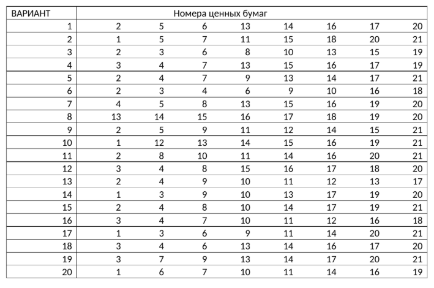

## Теоретические материалы

Подробные о факторном анализе методом максимального правдоподобия:

📄 [Факторный анализ. Метод максимального правдопродобия](FA_MMP.pdf)

## Лабораторная работа №4
### **Метод главных компонент. Метод максимального правдопродобия**

**Задание**
В таблице [файл “Данные”, лист “Котировки”](LAB_DATA_MSM.xlsx) приведены цены закрытия акций на ММВБ за
период с 01.01.2015 по 01.09.2015 с периодичностью 1 день.  
*Требуется:*
1. Для относительных приращений, приведенных в варианте задания ценных бумаг
(таблица 1), провести канонический факторный анализ методом максимального
правдоподобия:  

    a)
Оценить максимально возможное число обобщенных факторов
канонического факторного анализа для заданного числа исходных признаков.  
b)
Принять число обобщенных факторов  
c)
Используя итерационную процедуру метода максимального правдоподобия найти
оценки матрицы факторных нагрузок и дисперсий характерных факторов для
факторной модели.  
d)
Проверить значимость полученной модели. Если гипотеза о значимости факторной
модели отвергается, перейти к рассмотрению модели с числом факторов
повторить пункт c). Процесс завершается, если гипотеза о значимости факторной
модели принимается, либо число факторов
значения
.
2. Вне зависимости от того, построена ли значимая модель, или был достигнуто
ограничение по числу факторов, для последней построенной модели оценить выделенные
факторами дисперсии; доли дисперсий исходных признаков, объясняемые каждым
обобщенным фактором и совокупностью обобщенных факторов; дисперсии характерных
факторов. Записать разложение для исходных признаков через обобщенные и
характерные факторы, а также выражения для обобщенных факторов и найти оценки
значений факторов для всех наблюдений. Произвести классификацию (если это
возможно) обобщенных факторов.

*Таблица 1*. Варианты для расчета
