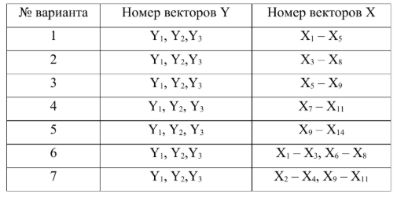
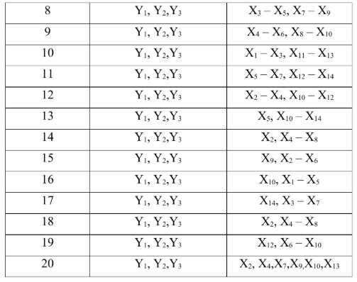

## Теоретические материалы

Подробные о факторном анализе методом максимального правдоподобия:

📄 [Факторный анализ. Метод максимального правдопродобия](FA_MMP.pdf)

## Лабораторная работа №5
### **Метод главных компонент. Метод максимального правдопродобия**

**Задание**
В таблице [файл “Данные”, лист “Показатели”](LAB_DATA_MSM.xlsx) приведены значения показателей
производственной деятельности для 53 предприятий машиностроения. Использовались
следующие показатели:
Использовались
следующие показатели: 
* Y1 – производительность труда; 
* Y2 – индекс снижения себестоимости продукции; 
* Y3 – рентабельность; 
+ X1 – трудоемкость единицы продукции;
+ X2 – удельный вес рабочих в составе ППП;
+ X3 – удельный вес покупных изделий; 
+ X4 – коэффициент сменности оборудования;
+ X5 – премии и вознаграждения на одного
работника;
+ X6 – удельный вес потерь от брака;
+ X7 – фондоотдача;
+ X8 – среднегодовая
численность ППП;
+ X9 – среднегодовая стоимость ОПФ;
+ X10 – среднегодовой фонд
заработной платы ППП;
+ X11 – фондовооруженность труда;
+ X12 – оборачиваемость
нормируемых оборотных средств;
+ X13 - оборачиваемость ненормируемых оборотных
средств;
+ X14 – непроизводственные расходы.
*Требуется:*
Для выбранных в соответствии с вариантом факторов (смотри таблицу 1) провести
канонический анализ для двух групп факторов Y и X:  
1. Найти оценки канонических переменных (найти канонические веса, использующиеся для
вычисления значений канонических переменных) и канонических корреляций.  
2. Произвести оценку значимости полученных канонических корреляций и, соответственно,
отсеять незначимые пары канонических переменных. Записать выражения для значимых
канонических переменных через исходные признаки.  
3. Найти корреляции между каноническими переменными и переменными из каждого
множества Y и X (координаты векторов канонических нагрузок).  
4. Вычислить извлеченную дисперсию каждой канонической переменной и совокупностью
канонических переменных (для каждого множества) и определить избыточность каждого
множества исходных данных.  

*Таблица 1.* Варианты расчета

