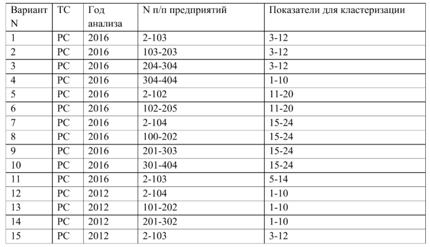
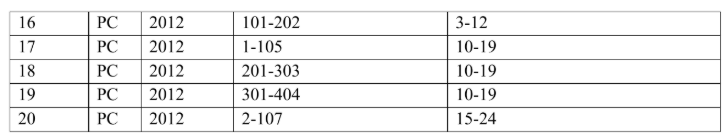

## Теоретические материалы

Подробные о кластерном анализе:

📄 [Кластерный анализ](FA_MMP.pdf)

## Лабораторная работа №6
### **Кластерный анализ**

**Задание**
В файле [“Данные” на листах “РС”, “CC”, “ИС”](LAB_DATA_MSM.xlsx) приведены экономические показатели
предприятий пищевой промышленности России за 2012 – 2016 годы различных форм
собственности. Для указанных в варианте задания типа собственности предприятий, года
анализа и группы экономических показателей требуется:  

1. Используя метод главных компонент, перейти от пространства исходных признаков
(показателей) к факторному пространству главных компонент, объясняющих не менее
70% вариации исходных признаков.  

2. Провести иерархическую кластеризацию предприятий на основе построенных главных
компонент, используя алгоритм Варда и выбрав в качестве меры близости объектов
евклидово расстояние.  
3. На основе, полученной в результате кластеризации дендрограммы, выбрать оптимальное
разбиение совокупности объектов на кластеры. В качестве оптимального разбиения
выбрать множество кластеров, для которого: 1) по каждому фактору (главной
компоненте) средние значения фактора по кластерам для всей совокупности кластеров
значимо различаются; 2) для каждой пары различных кластеров существует значимое
различие средних хотя бы для одного фактора (главной компоненты); 3) для любого
другого разбиения с большим числом кластеров условия 1 или 2 не выполняются. Для
анализа различий средних по кластерам использовать методы дисперсионного анализа.  
4. Провести кластеризацию той же совокупности, используя алгоритм k-средних, положив
число кластеров, равным, полученному числу кластеров на предыдущем этапе. Оценить
качество кластеризации, используя дисперсионный анализ (проверить для полученного
разбиения выполнение условий 1-2 предыдущего раздела).  

5. Сравнить полученные в пунктах 3 и 4 разбиения, используя в качестве функционала
качества разбиения сумму средних квадратов расстояний до центров кластеров.

*Таблица 1.* Варианты для расчета  

